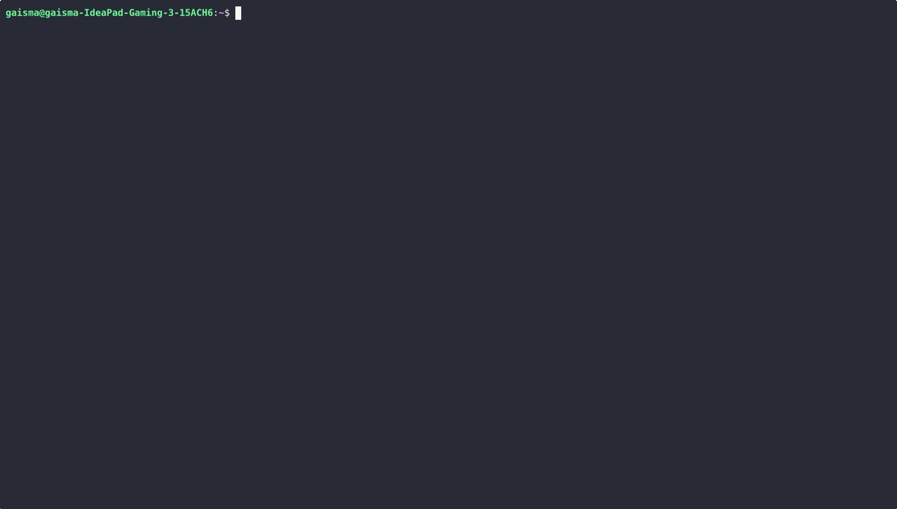

<div align="center">

```
   ██████╗██╗██████╗ ██╗  ██╗██████╗  █████╗ 
  ██╔════╝██║██╔══██╗██║  ██║██╔══██╗██╔══██╗
  ██║     ██║██████╔╝███████║██████╔╝███████║
  ██║     ██║██╔═══╝ ██╔══██║██╔══██╗██╔══██║
  ╚██████╗██║██║     ██║  ██║██║  ██║██║  ██║
   ╚═════╝╚═╝╚═╝     ╚═╝  ╚═╝╚═╝  ╚═╝╚═╝  ╚═╝
```

know what protects you.




</div>

---

## Features

- Verify files: SHA-256, SHA-512, SHA-1, MD5 hash + VirusTotal (70+ engines) + GPG signature
- Hash files
- Encrypt: AES-256-GCM + Argon2id password-based, or GPG public key
- Decrypt `.ciphra` and `.gpg` files
- Sign files with a detached GPG signature
- Create, export, extend, and delete GPG key pairs
- Manage encryption subkeys: add, rotate, extend expiry

---

## Requirements

- Python 3.10+
- GPG 2.1+ for signatures, encryption, and key management
- VirusTotal API key (optional, free and premium tiers supported): [virustotal.com](https://www.virustotal.com/gui/my-apikey)  
**Free tier:** 4 lookups/min, files up to 32 MB.  
**Premium:** higher limits, files up to 650 MB.

---

## Installation

```bash
pipx install git+https://github.com/gaisma22/ciphra
```

Or clone the repo:

```bash
git clone https://github.com/gaisma22/ciphra
cd ciphra
pipx install -e .
```

---

## Usage

Run `ciphra` to open the interactive menu.

Or use CLI flags directly:

```bash
# verify a file
ciphra verify file.iso

# verify with signature file, skip VirusTotal
ciphra verify file.iso --sig file.iso.sig --no-vt

# verify with expected hash and algorithm
ciphra verify file.iso --expected a1b2c3... --algo sha256

# hash a file
ciphra hash file.iso
ciphra hash file.iso --algo sha512

# configure VirusTotal API key
ciphra config --vt-key YOUR_KEY
ciphra config --show
ciphra config --remove-vt-key

# check version
ciphra --version

# set up tab completion
ciphra completions --shell bash
```

---

## Platform

Linux. Tested on Ubuntu 24, GPG 2.4.4. Works on any distro with Python 3.10+ and GPG 2.1+.

---

## License

MIT
